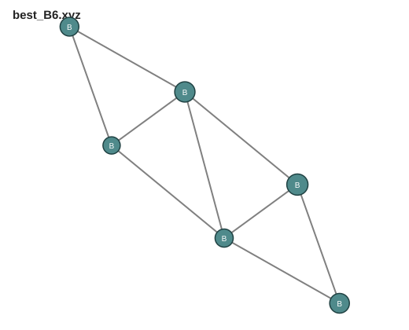
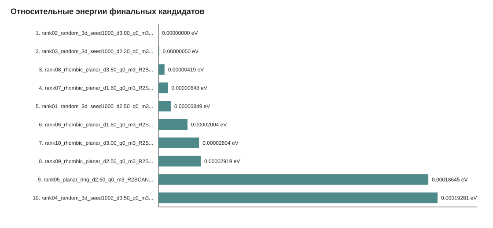
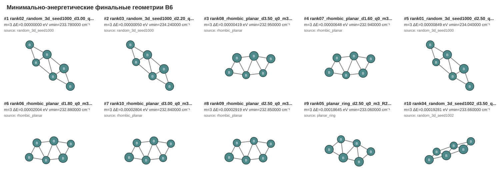
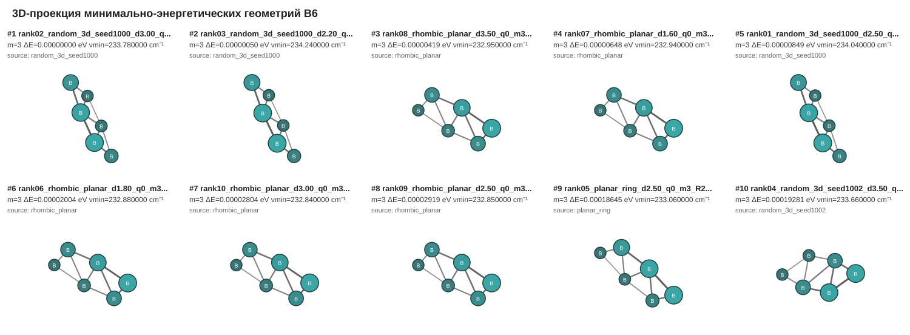
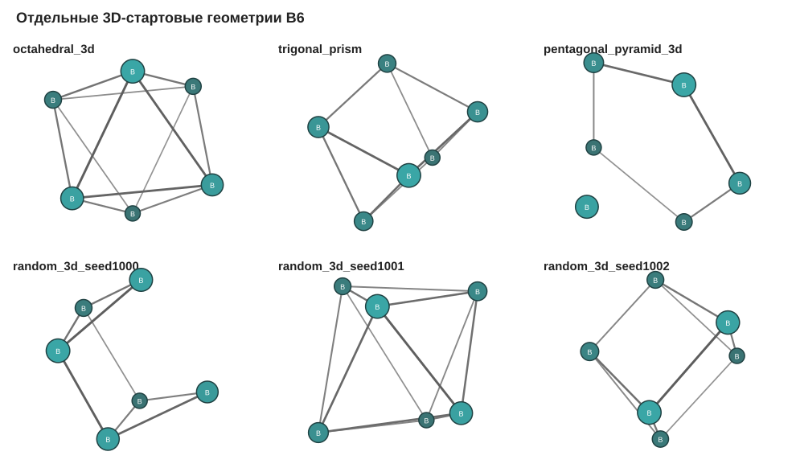
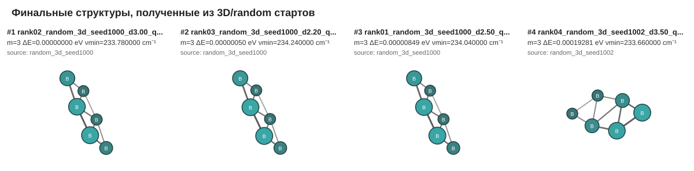
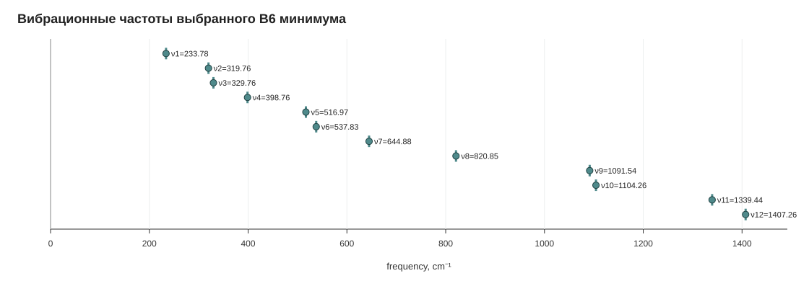
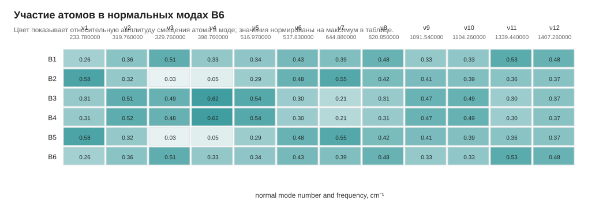

# B6_ORCA_campaign

Готовый пакет для автоматизированного поиска устойчивой геометрии кластера **B6** в **ORCA 6.1** на Linux/VPS.

В опубликованной расчётной кампании обработано **252 screening `.out` файла**. Текущая расширенная версия генератора по умолчанию поддерживает набор до **384 расчётов** = 8 расстояний × 16 стартовых геометрий × 3 мультиплетности. Поэтому числа `252` и `384` относятся к разным состояниям проекта: первое — к реально обработанным результатам, второе — к текущей расширенной генерации входных файлов.

Пакет делает:

- генерацию стартовых XYZ-геометрий B6;
- перебор геометрий, расстояний и мультиплетностей;
- создание отдельных папок расчётов;
- запуск ORCA через bash;
- повторный запуск неудачных расчётов;
- сбор энергий только из реальных `.out` файлов ORCA;
- подготовку финальных `Opt Freq` расчётов;
- проверку мнимых частот;
- выбор `best_B6.xyz` только среди структур без мнимых частот.

Численные энергии и частоты в этом пакете не заданы и не выдумываются.

## Отчёты и результаты

- [Итоговый отчёт Markdown](results/B6_final_report.md)
- [Итоговый отчёт TXT](results/B6_final_report.txt)
- [Screening-таблица](results/results.csv)
- [Финальная таблица](results/final_results.csv)
- [Все энергии](results/all_energies.csv)
- [Лучшая структура best_B6.xyz](results/best_B6.xyz)
- [Рисунки отчёта](results/figures/)

Краткий итог текущей кампании:

- screening: 252 `.out` файла, 243 нормальных завершения;
- final: 10 PBE0-D4/def2-TZVP OptFreq расчётов, 10 нормальных завершений;
- финальный минимум: `multiplicity = 3`;
- лучшая энергия: `-148.631808591174 Hartree`;
- мнимые частоты у выбранной структуры: `0`;
- минимальная ненулевая частота: `233.780000 cm-1`.

Финальная структура `best_B6.xyz`:



Относительные энергии финальных кандидатов:



Лучшие финальные геометрические конфигурации с минимальной энергией:



3D-проекция лучших финальных геометрий:



Интерактивная 3D-версия для вращения мышью: [Figure_7_min_energy_geometries_3d.html](results/figures/Figure_7_min_energy_geometries_3d.html)

Отдельно вынесены 3D/random-структуры из расчётной кампании:

- [screening_3d_results.csv](results/screening_3d_results.csv)
- [final_from_3d_results.csv](results/final_from_3d_results.csv)
- [3D-стартовые геометрии](results/figures/Figure_8_3d_start_geometries.svg)
- [финальные структуры из 3D/random стартов, интерактивно](results/figures/Figure_9_final_from_3d_starts_3d.html)





## Вибрационный анализ

Отдельный набор данных по частотам выбранной структуры:

- [Описание вибрационного анализа](results/vibrations/B6/README.md)
- [Все ненулевые частоты](results/vibrations/B6/B6_all_vibrational_frequencies.csv)
- [Сводка по нормальным модам](results/vibrations/B6/B6_mode_summary.csv)
- [Амплитуды нормальных мод](results/vibrations/B6/B6_normal_mode_amplitudes.csv)
- [Сырой ORCA-блок частот](results/vibrations/B6/B6_vibrational_frequencies_raw.txt)
- [ORCA output выбранной структуры](results/vibrations/B6/B6_best.out)
- [Hessian-файл](results/vibrations/B6/B6_best.hess)
- [Matplotlib-графики вибраций](results/vibrations/B6/matplotlib_plots/)
- [Страница с Matplotlib-графиками](results/vibrations/B6/matplotlib_plots/index.html)

Ключевой результат: 12 ненулевых вибрационных мод, диапазон `233.78–1407.26 cm^-1`, мнимые частоты отсутствуют.

Matplotlib-рисунки:

- [Figure_10_B6_vibrational_frequencies.svg](results/vibrations/B6/matplotlib_plots/Figure_10_B6_vibrational_frequencies.svg)
- [Figure_11_B6_max_amplitude_by_mode.svg](results/vibrations/B6/matplotlib_plots/Figure_11_B6_max_amplitude_by_mode.svg)
- [Figure_12_B6_frequency_vs_amplitude.svg](results/vibrations/B6/matplotlib_plots/Figure_12_B6_frequency_vs_amplitude.svg)
- [Figure_13_B6_atom_participation_heatmap.svg](results/vibrations/B6/matplotlib_plots/Figure_13_B6_atom_participation_heatmap.svg)
- [Figure_14_B6_dominant_atom_by_mode.svg](results/vibrations/B6/matplotlib_plots/Figure_14_B6_dominant_atom_by_mode.svg)
- [Figure_15_B6_frequency_distribution.svg](results/vibrations/B6/matplotlib_plots/Figure_15_B6_frequency_distribution.svg)
- [Figure_16_final_relative_energies_labeled.svg](results/vibrations/B6/matplotlib_plots/Figure_16_final_relative_energies_labeled.svg)
- [Figure_17_screening_success_rate.svg](results/vibrations/B6/matplotlib_plots/Figure_17_screening_success_rate.svg)





---

## Воспроизводимость

Для полного воспроизведения расчётного workflow необходимо:

1. установить ORCA 6.1;
2. указать переменную `ORCA_CMD`;
3. запустить `scripts/run_all.sh` для `calculations/stage1` и `calculations/final`;
4. собрать таблицы через `scripts/collect_results.py`;
5. проверить `results/final_results.csv` и `results/best_B6.xyz`.

Все пути в итоговых CSV записываются относительно корня репозитория, чтобы таблицы были переносимыми между Windows, Linux/VPS и GitHub.

---

## 1. Требования

- Linux VPS
- ORCA 6.1
- Python 3.8+
- CPU: до 8 cores
- RAM: 24 GB

Рекомендуемые настройки памяти:

```orca
%pal
  nprocs 8
end

%maxcore 2500
```

Пояснение: `2500 MB × 8 ≈ 20 GB`, остаётся запас для Linux и служебных процессов.

---

## 2. Структура проекта

```text
B6_ORCA_campaign/
├── README.md
├── setup_project.sh
├── scripts/
│   ├── generate_b6_inputs.py
│   ├── collect_results.py
│   ├── prepare_final_candidates.py
│   ├── run_all.sh
│   └── rerun_failed.sh
├── templates/
│   ├── stage1_opt_template.inp
│   └── final_opt_freq_template.inp
├── calculations/
│   ├── stage1/
│   └── final/
├── results/
└── logs/
```

---

## 3. Быстрый старт

```bash
cd ~/B6_ORCA_campaign
bash setup_project.sh

# Укажи путь к ORCA, если orca не находится через PATH:
export ORCA_CMD=/full/path/to/orca

# Проверка:
$ORCA_CMD --version
```

---

## 4. Этап 1 — генерация первичных расчётов

В архиве расчёты этапа 1 уже сгенерированы в `calculations/stage1`. Этот раздел нужен, если ты хочешь пересоздать их с другими параметрами.

По умолчанию будут созданы геометрии:

- linear_chain;
- planar_ring;
- distorted_planar_ring;
- compact_planar_triangle;
- rhombic_planar;
- rectangular_planar;
- fused_triangles_planar;
- quasi_planar;
- octahedral_3d;
- trigonal_prism;
- pentagonal_pyramid_3d;
- несколько random_3d.

Расстояния:

```text
1.5, 1.6, 1.8, 2.0, 2.2, 2.5, 3.0, 3.5 Å
```

Мультиплетности:

```text
1, 3, 5
```

Команда:

```bash
python3 scripts/generate_b6_inputs.py \
  --project-dir . \
  --stage-dir calculations/stage1 \
  --distances "1.5,1.6,1.8,2.0,2.2,2.5,3.0,3.5" \
  --multiplicities "1,3,5" \
  --charge 0 \
  --method R2SCAN-3C \
  --basis "" \
  --task Opt \
  --extra-keywords "TightSCF TightOpt" \
  --nprocs 8 \
  --maxcore 2500 \
  --n-random 5
```

Если `R2SCAN-3C` недоступен в твоей ORCA-сборке, попробуй:

```bash
--method B97-3C
```

или:

```bash
--method PBEH-3C
```

---

## 5. Запуск первичных расчётов

```bash
bash scripts/run_all.sh calculations/stage1
```

Если часть задач упала или не сошлась:

```bash
bash scripts/rerun_failed.sh calculations/stage1
```

---

## 6. Сбор результатов этапа 1

```bash
python3 scripts/collect_results.py \
  --root calculations/stage1 \
  --csv results/results.csv \
  --best-xyz results/best_B6.xyz \
  --all-energies-csv results/all_energies.csv
```

Просмотр таблицы:

```bash
column -s, -t < results/results.csv | less -S
```

На этапе 1 обычно нет частотного расчёта, поэтому `is_true_minimum` будет `False`. Это нормально.

---

## 7. Этап 2 — подготовка финальных Opt Freq кандидатов

Берём 10 лучших сошедшихся и геометрически недублирующихся структур этапа 1:

```bash
python3 scripts/prepare_final_candidates.py \
  --project-dir . \
  --results-csv results/results.csv \
  --final-dir calculations/final \
  --n 10 \
  --method PBE0 \
  --basis def2-TZVP \
  --extra-keywords "D4 def2/J RIJCOSX TightSCF TightOpt" \
  --nprocs 8 \
  --maxcore 2500
```

---

## 8. Запуск финальных Opt Freq расчётов

```bash
bash scripts/run_all.sh calculations/final
```

Если нужно:

```bash
bash scripts/rerun_failed.sh calculations/final
```

---

## 9. Финальный сбор результатов

```bash
python3 scripts/collect_results.py \
  --root calculations/final \
  --csv results/final_results.csv \
  --best-xyz results/best_B6.xyz \
  --report results/B6_final_report.txt

python3 scripts/build_b6_report.py --project-dir .
```

Просмотр:

```bash
column -s, -t < results/final_results.csv | less -S
cat results/best_B6.xyz
```

---

## 10. Критерий настоящего минимума

Структура считается настоящим минимумом только если:

```text
normal_termination = True
optimization_converged = True
has_imaginary_frequencies = False
n_imaginary_frequencies = 0
is_true_minimum = True
```

Если самая низкая по энергии структура имеет мнимые частоты, она не выбирается как `best_B6.xyz`.
Будет выбрана следующая по энергии структура без мнимых частот.

---

## 11. Что делать при мнимой частоте

1. Открыть `.out` или `.hess` в визуализаторе частот.
2. Найти imaginary mode.
3. Сместить структуру вдоль этой моды в плюс и минус направлениях.
4. Сохранить две структуры.
5. Запустить для них новый `Opt Freq`.

Общий принцип:

```text
R_new = R_old ± scale × eigenvector_imaginary_mode
```

Типичный `scale`: `0.05–0.15 Å`.

---

## 12. Полный чек-лист

```bash
cd ~/B6_ORCA_campaign
bash setup_project.sh
export ORCA_CMD=/full/path/to/orca

python3 scripts/generate_b6_inputs.py --project-dir .
bash scripts/run_all.sh calculations/stage1
python3 scripts/collect_results.py --root calculations/stage1 --csv results/results.csv --best-xyz results/best_B6.xyz --all-energies-csv results/all_energies.csv

python3 scripts/prepare_final_candidates.py --project-dir . --results-csv results/results.csv --n 10
bash scripts/run_all.sh calculations/final
python3 scripts/collect_results.py --root calculations/final --csv results/final_results.csv --best-xyz results/best_B6.xyz --report results/B6_final_report.txt
python3 scripts/build_b6_report.py --project-dir .

column -s, -t < results/final_results.csv | less -S
cat results/best_B6.xyz
```
