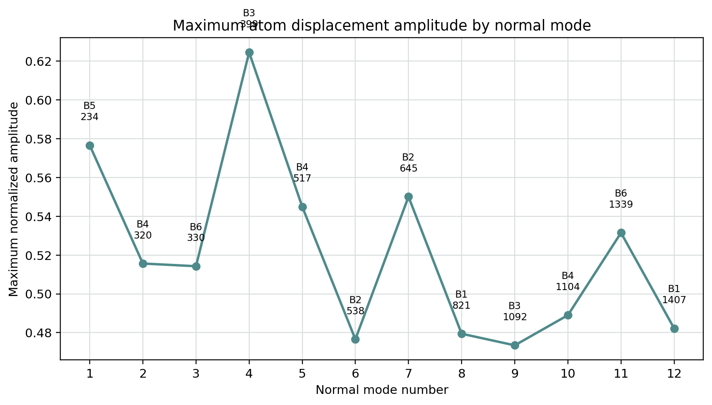
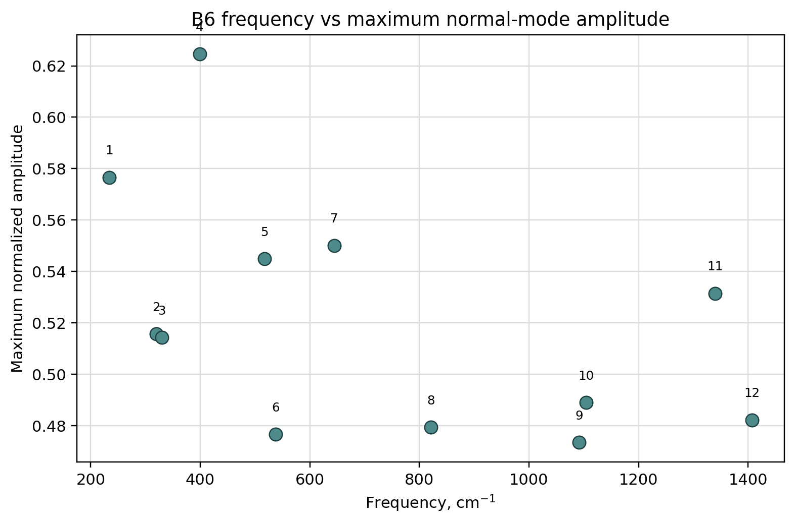
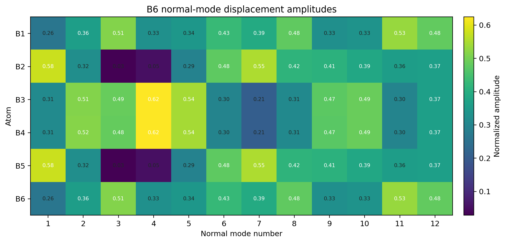
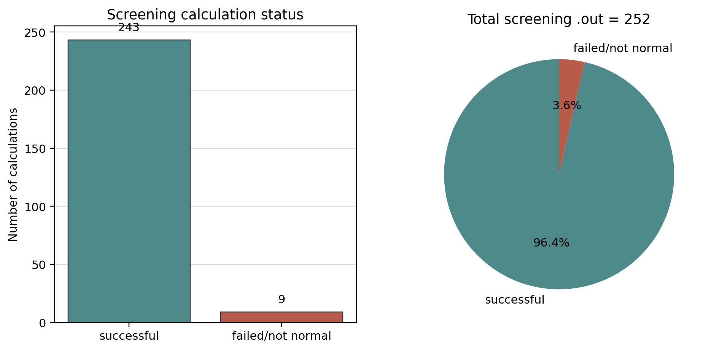
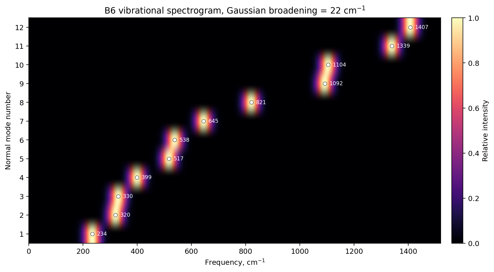
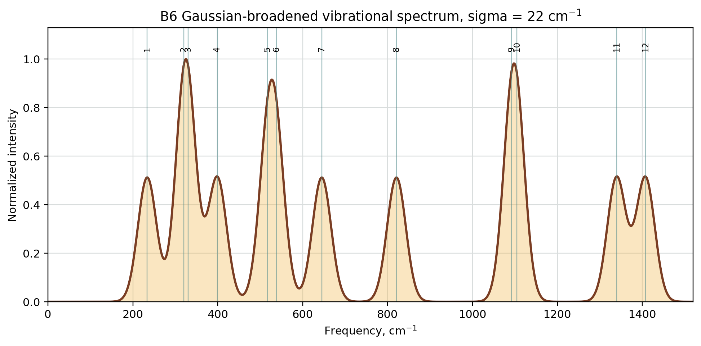

# B6 vibrational analysis

[← Main project README](../../../README.md)

This folder contains vibrational analysis results for the selected best B6 structure.

## Selected structure

- Cluster: B6
- Charge: 0
- Multiplicity: 3
- Method: PBE0-D4/def2-TZVP OptFreq
- Imaginary frequencies: 0
- Number of real vibrational modes: 12
- Frequency range: 233.78–1407.26 cm^-1

## Files

| File | Description |
|---|---|
| B6_all_vibrational_frequencies.csv | All 12 non-zero vibrational frequencies |
| B6_normal_mode_amplitudes.csv | Normal-mode displacement components dx, dy, dz and amplitude for each atom |
| B6_mode_summary.csv | Summary table: max amplitude and dominant atom for each mode |
| B6_vibrational_frequencies_raw.txt | Raw ORCA frequency block |
| B6_best.out | ORCA output file of the selected best structure |
| B6_best.hess | ORCA Hessian file containing vibrational information |
| B6_best_optimized.xyz | Optimized geometry of the selected B6 structure |

## Matplotlib plots

Matplotlib plots are stored in a separate folder:

[`matplotlib_plots/`](matplotlib_plots/)

Graph gallery page:

[matplotlib_plots/README.md](matplotlib_plots/README.md)

HTML version:

[matplotlib_plots/index.html](matplotlib_plots/index.html)

| Figure | Plot | Source file | What it shows |
|---|---|---|---|
| Figure 10 | [Figure_10_B6_vibrational_frequencies.svg](matplotlib_plots/Figure_10_B6_vibrational_frequencies.svg) | `B6_all_vibrational_frequencies.csv` | Bar chart of all 12 non-zero B6 vibrational frequencies |
| Figure 11 | [Figure_11_B6_max_amplitude_by_mode.svg](matplotlib_plots/Figure_11_B6_max_amplitude_by_mode.svg) | `B6_mode_summary.csv` | Maximum displacement amplitude by normal mode |
| Figure 12 | [Figure_12_B6_frequency_vs_amplitude.svg](matplotlib_plots/Figure_12_B6_frequency_vs_amplitude.svg) | `B6_mode_summary.csv` | Frequency versus maximum amplitude scatter plot |
| Figure 13 | [Figure_13_B6_atom_participation_heatmap.svg](matplotlib_plots/Figure_13_B6_atom_participation_heatmap.svg) | `B6_normal_mode_amplitudes.csv` | Atom participation heatmap by mode |
| Figure 14 | [Figure_14_B6_dominant_atom_by_mode.svg](matplotlib_plots/Figure_14_B6_dominant_atom_by_mode.svg) | `B6_mode_summary.csv` | Dominant atom index for each mode |
| Figure 15 | [Figure_15_B6_frequency_distribution.svg](matplotlib_plots/Figure_15_B6_frequency_distribution.svg) | `B6_all_vibrational_frequencies.csv` | Frequency distribution over low/mid/high ranges |
| Figure 16 | [Figure_16_final_relative_energies_labeled.svg](matplotlib_plots/Figure_16_final_relative_energies_labeled.svg) | `../../final_results.csv` | Final relative energies with multiplicity labels and best_B6 marker |
| Figure 17 | [Figure_17_screening_success_rate.svg](matplotlib_plots/Figure_17_screening_success_rate.svg) | `../../results.csv` | Screening success/fail summary |
| Figure 18 | [Figure_18_B6_vibrational_spectrogram.svg](matplotlib_plots/Figure_18_B6_vibrational_spectrogram.svg) | `B6_all_vibrational_frequencies.csv` | Gaussian-broadened 2D spectrogram of B6 vibrational frequencies |
| Figure 19 | [Figure_19_B6_broadened_vibrational_spectrum.svg](matplotlib_plots/Figure_19_B6_broadened_vibrational_spectrum.svg) | `B6_all_vibrational_frequencies.csv` | Summed Gaussian-broadened B6 vibrational spectrum |
| Supplement | [B6_vibrational_spectrum_lines.svg](matplotlib_plots/B6_vibrational_spectrum_lines.svg) | `B6_all_vibrational_frequencies.csv` | Line-spectrum representation of the vibrational frequencies |
| Manifest | [plots_manifest.csv](matplotlib_plots/plots_manifest.csv) | generated | Manifest of generated PNG/SVG plot files |

Preview:














To regenerate these plots:

```bash
python3 scripts/plot_b6_vibrations_matplotlib.py \
  --project-dir . \
  --input-dir results/vibrations/B6 \
  --output-dir results/vibrations/B6/matplotlib_plots \
  --final-csv results/final_results.csv \
  --screening-csv results/results.csv \
  --spectrogram-sigma 22.0
```

## Note

The displacement amplitudes are normalized normal-mode components from ORCA.
They describe relative participation of atoms in each vibrational mode and should not be interpreted as absolute thermal amplitudes in angstroms.
