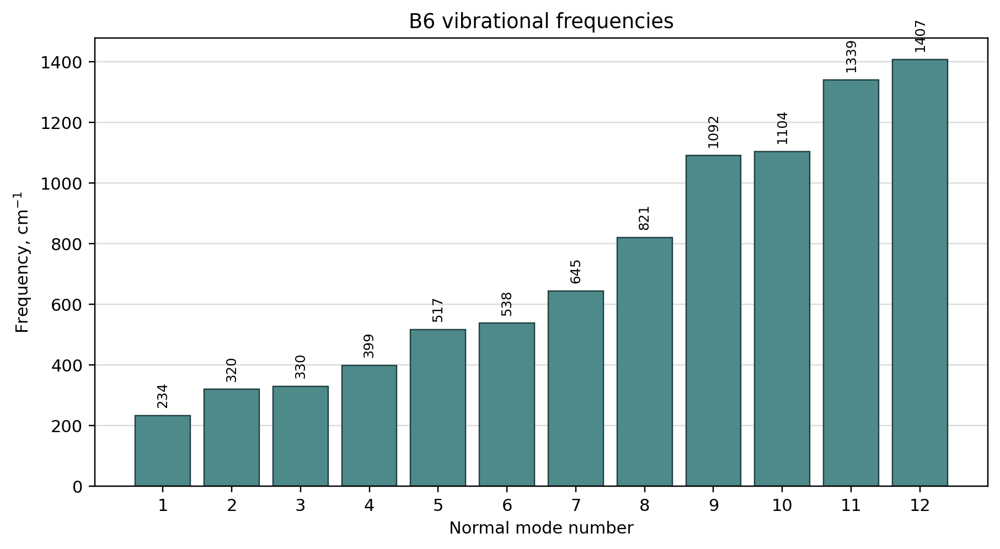

# B6 vibrational analysis

This folder contains vibrational analysis results for the selected best B6 structure.

## Selected structure

- Cluster: B6
- Charge: 0
- Multiplicity: 3
- Method: PBE0-D4/def2-TZVP OptFreq
- Imaginary frequencies: 0
- Number of real vibrational modes: 12
- Frequency range: 233.78–1407.26 cm^-1

## Files

| File | Description |
|---|---|
| B6_all_vibrational_frequencies.csv | All 12 non-zero vibrational frequencies |
| B6_normal_mode_amplitudes.csv | Normal-mode displacement components dx, dy, dz and amplitude for each atom |
| B6_mode_summary.csv | Summary table: max amplitude and dominant atom for each mode |
| B6_vibrational_frequencies_raw.txt | Raw ORCA frequency block |
| B6_best.out | ORCA output file of the selected best structure |
| B6_best.hess | ORCA Hessian file containing vibrational information |
| B6_best_optimized.xyz | Optimized geometry of the selected B6 structure |

## Matplotlib plots

Matplotlib plots are stored in a separate folder:

[`matplotlib_plots/`](matplotlib_plots/)

| Plot | Description |
|---|---|
| [B6_vibrational_frequencies_bar.png](matplotlib_plots/B6_vibrational_frequencies_bar.png) | Bar plot of all 12 non-zero vibrational frequencies |
| [B6_vibrational_spectrum_lines.png](matplotlib_plots/B6_vibrational_spectrum_lines.png) | Line-spectrum representation of the same frequencies |
| [B6_normal_mode_amplitudes_heatmap.png](matplotlib_plots/B6_normal_mode_amplitudes_heatmap.png) | Heatmap of normalized atom displacement amplitudes by mode |
| [B6_max_amplitude_by_mode.png](matplotlib_plots/B6_max_amplitude_by_mode.png) | Maximum normal-mode amplitude and dominant atom for each mode |
| [plots_manifest.csv](matplotlib_plots/plots_manifest.csv) | Manifest of generated PNG/SVG plot files |

Preview:




To regenerate these plots:

```bash
python3 scripts/plot_b6_vibrations_matplotlib.py \
  --input-dir results/vibrations/B6 \
  --output-dir results/vibrations/B6/matplotlib_plots
```

## Note

The displacement amplitudes are normalized normal-mode components from ORCA.
They describe relative participation of atoms in each vibrational mode and should not be interpreted as absolute thermal amplitudes in angstroms.
