# B6 Matplotlib Graph Gallery

[← Vibration README](../README.md) | [Main project README](../../../../README.md) | [Plot manifest](plots_manifest.csv)

This page collects Matplotlib plots generated from the B6 ORCA campaign vibration, final-energy, and screening CSV files.

## Figure 10. B6 Vibrational Frequencies

Bar chart of all 12 non-zero normal-mode frequencies from B6_all_vibrational_frequencies.csv.

[SVG](Figure_10_B6_vibrational_frequencies.svg) | [PNG](Figure_10_B6_vibrational_frequencies.png)

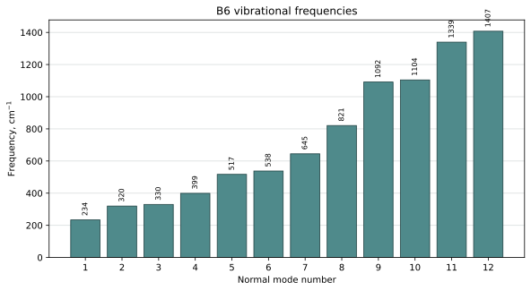

## Figure 11. Maximum Amplitude By Mode

Maximum normalized normal-mode displacement amplitude and dominant atom label for each mode.

[SVG](Figure_11_B6_max_amplitude_by_mode.svg) | [PNG](Figure_11_B6_max_amplitude_by_mode.png)

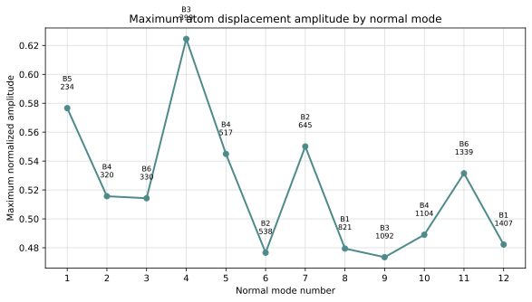

## Figure 12. Frequency Vs Maximum Amplitude

Scatter plot for checking whether higher-frequency modes show systematically different displacement amplitudes.

[SVG](Figure_12_B6_frequency_vs_amplitude.svg) | [PNG](Figure_12_B6_frequency_vs_amplitude.png)

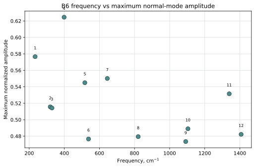

## Figure 13. Atom Participation Heatmap

Heatmap of atom-by-mode displacement amplitudes from B6_normal_mode_amplitudes.csv.

[SVG](Figure_13_B6_atom_participation_heatmap.svg) | [PNG](Figure_13_B6_atom_participation_heatmap.png)

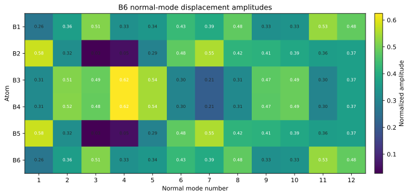

## Figure 14. Dominant Atom By Mode

Dominant atom index for every normal mode, based on the largest normalized displacement amplitude.

[SVG](Figure_14_B6_dominant_atom_by_mode.svg) | [PNG](Figure_14_B6_dominant_atom_by_mode.png)

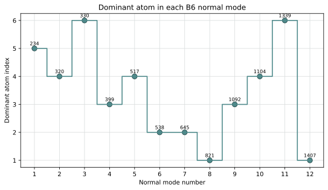

## Figure 15. Frequency Distribution

Histogram showing how B6 vibrational modes are distributed across low, medium, and high frequency ranges.

[SVG](Figure_15_B6_frequency_distribution.svg) | [PNG](Figure_15_B6_frequency_distribution.png)

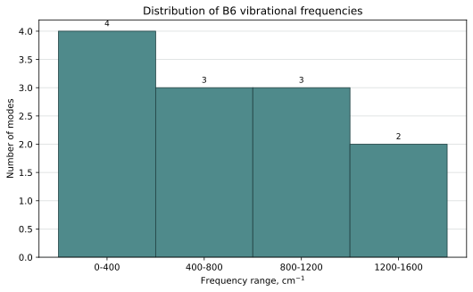

## Figure 16. Final Relative Energies

Final PBE0-D4/def2-TZVP candidate energies by rank, with multiplicity labels and the best_B6 marker.

[SVG](Figure_16_final_relative_energies_labeled.svg) | [PNG](Figure_16_final_relative_energies_labeled.png)

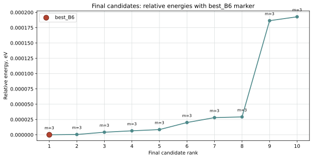

## Figure 17. Screening Success Rate

Successful versus failed/not-normal R2SCAN-3C screening calculations.

[SVG](Figure_17_screening_success_rate.svg) | [PNG](Figure_17_screening_success_rate.png)

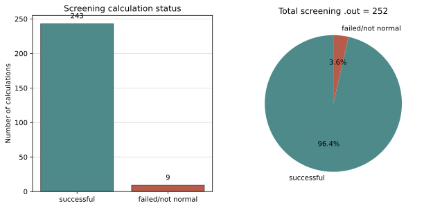

## Figure 18. B6 Vibrational Spectrogram

Gaussian-broadened 2D frequency spectrogram built from the 12 non-zero B6 normal-mode frequencies.

[SVG](Figure_18_B6_vibrational_spectrogram.svg) | [PNG](Figure_18_B6_vibrational_spectrogram.png)

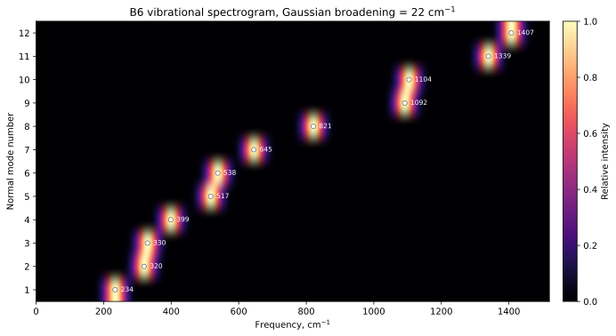

## Figure 19. B6 Broadened Vibrational Spectrum

Summed Gaussian-broadened spectrum of the 12 B6 normal-mode frequencies.

[SVG](Figure_19_B6_broadened_vibrational_spectrum.svg) | [PNG](Figure_19_B6_broadened_vibrational_spectrum.png)

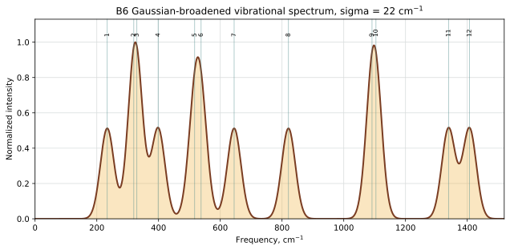

## Supplement. Frequency Line Spectrum

Line-spectrum representation of the same non-zero vibrational frequencies.

[SVG](B6_vibrational_spectrum_lines.svg) | [PNG](B6_vibrational_spectrum_lines.png)

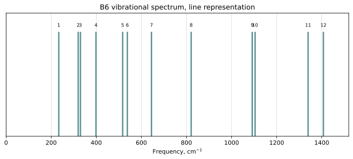

## Regeneration

Run from the repository root:

```bash
python3 scripts/plot_b6_vibrations_matplotlib.py \
  --project-dir . \
  --input-dir results/vibrations/B6 \
  --output-dir results/vibrations/B6/matplotlib_plots \
  --final-csv results/final_results.csv \
  --screening-csv results/results.csv \
  --spectrogram-sigma 22.0
```
